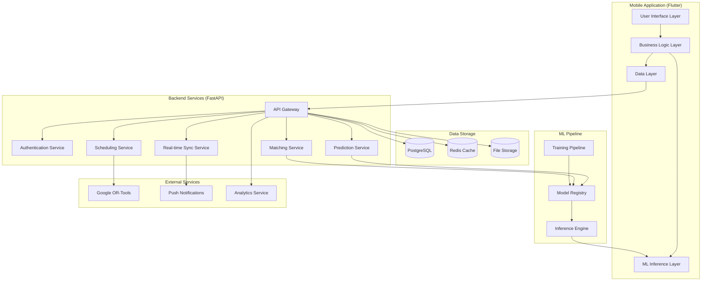

# Design Document: ADRYFT Behavioral OS

## Overview

ADRYFT is a comprehensive behavioral operating system designed specifically for JEE/NEET aspirants in India. The platform addresses critical behavioral challenges through five integrated AI-powered features that work synergistically to optimize learning outcomes. The system combines constraint satisfaction optimization, multi-sensor behavioral analysis, predictive machine learning, social learning dynamics, and adaptive assessment to create a holistic learning environment.

The architecture follows a mobile-first, offline-capable design using Flutter for cross-platform deployment, with a Python FastAPI backend providing real-time synchronization and ML processing. The system emphasizes privacy-by-design with on-device inference where possible and tiered data access controls.

## Architecture

### System Architecture Overview



### Technology Stack

**Frontend (Mobile)**
- **Framework**: Flutter 3.x for cross-platform native performance
- **State Management**: Riverpod for reactive state management
- **Local Storage**: SQLite with Drift ORM for offline-first architecture
- **ML Inference**: TensorFlow Lite for on-device model execution
- **Real-time**: WebSocket client for live synchronization

**Backend Services**
- **API Framework**: Python FastAPI with async/await for high concurrency
- **Authentication**: JWT tokens with refresh mechanism
- **Scheduling Engine**: Google OR-Tools CP-SAT solver integration
- **ML Framework**: Scikit-learn for training, PyTorch for deep learning models
- **Real-time**: WebSocket server with Redis pub/sub for scaling

**Data Layer**
- **Primary Database**: Supabase PostgreSQL with row-level security
- **Caching**: Redis for session management and real-time data
- **File Storage**: Supabase Storage for user-generated content
- **Analytics**: Custom event tracking with privacy controls

**Infrastructure**
- **Deployment**: Docker containers on cloud infrastructure
- **Monitoring**: Application performance monitoring and error tracking
- **Security**: End-to-end encryption, API rate limiting, input validation

## Components and Interfaces

### 1. AI Adaptive Scheduler Component

**Core Algorithm**: Constraint Satisfaction Problem (CSP) solver using Google OR-Tools CP-SAT

**Key Interfaces**:
```python
class ScheduleRequest:
    student_id: str
    date_range: DateRange
    preferences: StudentPreferences
    constraints: List[Constraint]

class ScheduleResponse:
    schedule: DailySchedule
    satisfaction_score: float
    generation_time_ms: int
    constraint_violations: List[str]

class SchedulingService:
    def generate_schedule(request: ScheduleRequest) -> ScheduleResponse
    def update_constraints(student_id: str, constraints: List[Constraint])
    def get_optimization_metrics() -> OptimizationMetrics
```

**Constraint Types**:
- **Curriculum Prerequisites**: Topic dependency graphs for JEE/NEET/Board subjects
- **Spaced Repetition**: Ebbinghaus curve-based review scheduling (intervals: 1, 3, 8, 20, 60+ days)
- **Chronotype Optimization**: Peak cognitive hours (6-8am, 4-6pm for difficult topics)
- **Extracurricular Integration**: Mandatory blocks for physical activity and creative pursuits
- **Study Load Balancing**: Maximum daily study hours with mandatory breaks
- **Personal Preferences**: Subject preferences, break durations, sleep schedule

**Optimization Objective**:
```
Maximize: Learning_Efficiency × Schedule_Adherence × Well_being_Score
Subject to: 100+ constraints including prerequisites, time limits, and personal preferences
```

### 2. RIVER Focus Quality Detection Component

**Multi-Sensor Architecture**:
```python
class SensorData:
    gyroscope: GyroscopeReading
    app_classification: AppUsageData
    phone_orientation: OrientationData
    eye_gaze: Optional[EyeGazeData]
    timestamp: datetime

class FocusQualityCalculator:
    def calculate_focus_score(sensors: SensorData) -> FocusScore
    def update_ml_model(training_data: List[LabeledSession])
    def get_real_time_status() -> FocusStatus
```

**ML Model Architecture**:
- **Algorithm**: Random Forest with 100 trees
- **Training Data**: 10,000+ labeled focus sessions
- **Features**: 
  - Gyroscope stability (movement patterns)
  - App classification (educational vs. distracting)
  - Phone orientation (study position vs. casual use)
  - Eye gaze patterns (optional, privacy-controlled)
- **Composite Score**: `0.3×Gyro + 0.35×AppClass + 0.2×Orientation + 0.15×EyeGaze`

**River Visualization**:
- **Width**: Consistency of focus over time
- **Height**: Quality hours accumulated
- **Flow Rate**: Real-time focus intensity
- **Color**: Current focus state (deep blue = high focus, light blue = moderate, gray = distracted)

### 3. Burnout Prediction Engine Component

**Ensemble ML Architecture**:
```python
class BurnoutPredictor:
    rf_model: RandomForestClassifier  # 70% weight
    xgb_model: XGBClassifier         # 30% weight
    
    def predict_burnout_risk(student_data: StudentBehaviorData) -> BurnoutPrediction
    def trigger_intervention(risk_level: RiskLevel) -> InterventionPlan
    def update_model(feedback_data: List[BurnoutOutcome])
```

**Feature Engineering**:
- **Sleep Patterns** (20% importance): Duration, consistency, quality scores
- **Focus Trends** (18% importance): Declining focus quality over time
- **Micro-pause Behavior** (15% importance): Break frequency and duration
- **Distraction Ratio** (12% importance): Time spent on non-educational apps
- **Engagement Decline** (10% importance): Reduced interaction with study materials
- **Social Isolation** (8% importance): Decreased pod participation
- **Physical Activity** (7% importance): Exercise frequency and intensity
- **Academic Performance** (5% importance): Practice test scores and trends
- **Stress Indicators** (5% importance): Self-reported stress levels

**Intervention System**:
```python
class InterventionEngine:
    def sports_break_intervention() -> SportsPlan
    def sleep_optimization_intervention() -> SleepPlan  
    def peer_support_intervention() -> PeerSupportPlan
    def schedule_reduction_intervention() -> ReducedSchedule
```

### 4. Study Pods Component

**AI Matching Algorithm**:
```python
class PodMatcher:
    def calculate_compatibility_score(student1: Student, student2: Student) -> float
    def form_optimal_pods(students: List[Student]) -> List[Pod]
    def rebalance_pods(existing_pods: List[Pod]) -> List[Pod]

# Matching Score Formula:
# Score = 0.30×Topic_Similarity + 0.25×Goal_Alignment + 0.20×Learning_Style + 
#         0.15×Toxicity_Avoidance + 0.07×Timezone_Compatibility + 0.03×Stability_Score
```

**Campfire Visualization**:
- **Visual Metaphor**: Animated campfire with 5 seats around it
- **Status Indicators**:
  - Green flame: Student actively focused
  - Yellow flame: Student on break
  - Gray ember: Student offline
  - Flickering: Student struggling (needs support)

**Communication Management**:
- **Focus Hours**: Chat disabled 6am-11pm to maintain concentration
- **AI Moderation**: Toxic language filtering using sentiment analysis
- **Support Rotation**: Weekly designated support member for encouragement

### 5. Custom Practice Generation Component

**Bayesian Adaptive Testing Engine**:
```python
class AdaptivePracticeGenerator:
    def generate_problem_set(student_profile: StudentProfile) -> ProblemSet
    def update_difficulty(performance: ProblemPerformance) -> DifficultyAdjustment
    def schedule_spaced_reviews(mastered_topics: List[Topic]) -> ReviewSchedule
```

**Difficulty Optimization**:
- **Target Success Rate**: 65% (optimal for learning according to research)
- **Bayesian Updates**: Continuous adjustment based on student responses
- **Problem Bank**: 500+ problems per weak topic, indexed by:
  - Difficulty level (1-10 scale)
  - Sub-topic classification
  - Learning style compatibility (visual, auditory, kinesthetic)
  - Exam pattern alignment (JEE/NEET/Board specific)

**Spaced Repetition Integration**:
- **Initial Review**: Day 1 after first exposure
- **Subsequent Reviews**: Days 3, 8, 20, 60+ based on retention performance
- **Adaptive Intervals**: Extend intervals for well-retained topics, shorten for struggling areas

## Data Models

### Core Data Structures

```python
@dataclass
class Student:
    id: str
    profile: StudentProfile
    preferences: StudentPreferences
    academic_data: AcademicData
    behavioral_data: BehavioralData
    privacy_settings: PrivacySettings

@dataclass
class StudentProfile:
    name: str
    exam_targets: List[ExamType]  # JEE, NEET, Board
    chronotype: ChronotypeData
    learning_style: LearningStyle
    extracurricular_interests: List[Activity]

@dataclass
class BehavioralData:
    focus_sessions: List[FocusSession]
    sleep_patterns: List[SleepData]
    app_usage: List[AppUsageSession]
    stress_indicators: List[StressReading]
    social_interactions: List[PodInteraction]

@dataclass
class Schedule:
    student_id: str
    date: date
    time_blocks: List[TimeBlock]
    optimization_score: float
    adherence_rate: float

@dataclass
class TimeBlock:
    start_time: time
    end_time: time
    activity_type: ActivityType
    subject: Optional[Subject]
    difficulty_level: int
    break_after: bool

@dataclass
class Pod:
    id: str
    members: List[str]  # Student IDs
    compatibility_score: float
    formation_date: date
    activity_log: List[PodActivity]
    support_rotation: List[SupportWeek]

@dataclass
class ProblemSet:
    student_id: str
    topic: Topic
    problems: List[Problem]
    target_difficulty: float
    estimated_duration: int
    spaced_review_date: Optional[date]
```

### Database Schema Design

**Students Table**:
- Primary key: student_id (UUID)
- Profile data: JSON column for flexible schema
- Behavioral metrics: Aggregated scores and trends
- Privacy controls: Granular permission settings

**Focus Sessions Table**:
- Foreign key: student_id
- Sensor data: Compressed JSON for multi-sensor readings
- Quality scores: Calculated focus metrics
- Session metadata: Duration, subject, environment

**Schedules Table**:
- Composite key: (student_id, date)
- Schedule data: JSON array of time blocks
- Optimization metrics: Constraint satisfaction scores
- Adherence tracking: Actual vs. planned execution

**Pods Table**:
- Primary key: pod_id (UUID)
- Member relationships: Junction table for many-to-many
- Interaction logs: Chat and support activity
- Performance metrics: Group engagement scores

## Correctness Properties

*A property is a characteristic or behavior that should hold true across all valid executions of a system—essentially, a formal statement about what the system should do. Properties serve as the bridge between human-readable specifications and machine-verifiable correctness guarantees.*

Let me analyze the acceptance criteria to determine which ones can be tested as properties.

Based on the prework analysis, I'll now convert the testable acceptance criteria into correctness properties:

### Property 1: Schedule Generation Completeness
*For any* student profile and date range, the AI scheduler should generate a schedule that includes all required elements: curriculum prerequisites in correct order, spaced repetition intervals (1, 3, 8, 20, 60+ days), high-difficulty topics during peak chronotype hours, and mandatory extracurricular blocks.
**Validates: Requirements 1.3, 1.4, 1.5, 1.6**

### Property 2: Constraint Satisfaction Performance
*For any* schedule generation request with 100+ constraints, the system should satisfy 95% or more constraints and return results within 3 seconds.
**Validates: Requirements 1.1, 1.2**

### Property 3: Multi-Sensor Focus Calculation
*For any* focus measurement session, the RIVER system should collect data from all available sensors (gyroscope, app classification, phone orientation, optional eye-gaze) and calculate focus quality using the exact formula: 0.3×Gyro + 0.35×AppClass + 0.2×Orientation + 0.15×EyeGaze.
**Validates: Requirements 2.1, 2.2**

### Property 4: Focus Visualization Consistency
*For any* focus data, the river visualization should correctly map width to consistency, height to quality hours, and flow rate to real-time status, with milestone achievements triggering appropriate gamification rewards.
**Validates: Requirements 2.4, 2.5**

### Property 5: Learning vs Passive Time Classification
*For any* study session, the RIVER system should correctly distinguish between genuine learning time and passive time logging based on multi-sensor analysis.
**Validates: Requirements 2.8**

### Property 6: Burnout Prediction Ensemble Weighting
*For any* burnout risk calculation, the system should use the correct ensemble model weights (Random Forest 70%, XGBoost 30%) and feature importance weights (Sleep 20%, focus trend 18%, micro-pauses 15%, distraction ratio 12%, etc.).
**Validates: Requirements 3.2, 3.4**

### Property 7: Wellness Monitoring Completeness
*For any* student, the burnout engine should continuously track all required wellness indicators: sleep patterns, focus trends, attention fatigue, engagement decline, and distraction behavior.
**Validates: Requirements 3.3**

### Property 8: Intervention Triggering
*For any* high burnout risk detection, the system should automatically trigger one of the four intervention types: sports break, sleep optimization, peer support, or schedule reduction.
**Validates: Requirements 3.5**

### Property 9: Privacy-Preserving Processing
*For any* sensitive behavioral data processing, the system should perform ML inference on-device where possible and maintain end-to-end encryption for all student information.
**Validates: Requirements 3.8, 7.1, 7.5**

### Property 10: Pod Formation Rules
*For any* student matching request, the Study Pods system should create groups of exactly 5 students using the compatibility formula: 0.30×Topic + 0.25×Goal + 0.20×LearningStyle + 0.15×ToxicityAvoidance + 0.07×Timezone + 0.03×Stability.
**Validates: Requirements 4.1, 4.2**

### Property 11: Pod Communication Controls
*For any* pod interaction, the system should disable chat during focus hours (6am-11pm), filter toxic language, implement weekly support rotation, and facilitate minimum 4 support interactions per student per week.
**Validates: Requirements 4.4, 4.5, 4.7, 4.8**

### Property 12: Campfire Status Visualization
*For any* pod member status change, the campfire visualization should correctly display green (focused), yellow (break), or grey (offline) indicators.
**Validates: Requirements 4.3**

### Property 13: Adaptive Problem Generation
*For any* weak topic identified, the Practice Generator should deliver problems targeting that topic at optimal difficulty using Bayesian Adaptive Testing to maintain 65% success rate.
**Validates: Requirements 5.1, 5.2**

### Property 14: Spaced Repetition Scheduling
*For any* mastered topic, the system should schedule reviews at correct spaced intervals (Day 1, 3, 8, 20, 60+) and adjust intervals based on retention performance.
**Validates: Requirements 5.3, 5.6**

### Property 15: Problem Bank Adequacy
*For any* weak topic, the system should access a problem bank containing 500+ problems indexed by difficulty, sub-topic, and learning style, with all problems aligned to JEE/NEET/Board exam patterns.
**Validates: Requirements 5.4, 5.7**

### Property 16: Progress Analytics Completeness
*For any* student practice session, the system should track and provide detailed analytics on topic-wise improvement and retention rates.
**Validates: Requirements 5.8**

### Property 17: System Performance Requirements
*For any* critical operation, the system should maintain 60 FPS mobile performance, support 2GB RAM devices, and respond within 3 seconds, while reducing planning time by 95% compared to manual methods.
**Validates: Requirements 6.2, 6.8, 8.4**

### Property 18: Data Security and Access Control
*For any* data storage operation, the system should implement encryption at rest, row-level security, and tiered access control where students see all data, parents see wellness trends, and coaching centers see aggregated analytics only.
**Validates: Requirements 6.5, 7.3**

### Property 19: Real-time Synchronization
*For any* data update, the system should synchronize changes in real-time across all connected devices using WebSocket connections.
**Validates: Requirements 6.7**

### Property 20: Privacy Control Completeness
*For any* student privacy request, the system should allow full control over data deletion, opt-outs, and private mode settings, with permanent data removal within 30 days of deletion requests.
**Validates: Requirements 7.2, 7.6**

### Property 21: Consent-Based Data Sharing
*For any* third-party data sharing request, the system should require explicit student consent and immediately alert students of any privacy violations with remediation options.
**Validates: Requirements 7.4, 7.7**

## Error Handling

### Error Categories and Responses

**1. Scheduling Failures**
- **Constraint Conflicts**: When constraints cannot be satisfied, provide partial schedule with clear explanation of conflicts
- **Timeout Errors**: If CSP solver exceeds 3-second limit, return best-effort schedule with warning
- **Data Inconsistency**: Validate student profile data before scheduling, prompt for corrections

**2. Sensor Data Errors**
- **Missing Sensors**: Gracefully degrade focus quality calculation when sensors unavailable
- **Calibration Issues**: Detect and prompt for sensor recalibration when accuracy drops
- **Privacy Blocks**: Handle user-disabled sensors without breaking core functionality

**3. ML Model Failures**
- **Prediction Errors**: Fallback to rule-based systems when ML models fail
- **Model Drift**: Monitor prediction accuracy and trigger retraining when performance degrades
- **Insufficient Data**: Provide conservative estimates when training data is limited

**4. Network and Sync Errors**
- **Offline Mode**: Maintain full functionality with local data, sync when connection restored
- **Sync Conflicts**: Implement conflict resolution with user preference priority
- **API Failures**: Retry with exponential backoff, fallback to cached data

**5. Privacy and Security Errors**
- **Encryption Failures**: Fail securely, never store unencrypted sensitive data
- **Access Violations**: Log security events, immediately revoke compromised access
- **Consent Violations**: Block operations requiring consent until explicitly granted

### Error Recovery Strategies

**Graceful Degradation**:
- Core functionality remains available even when advanced features fail
- Clear user communication about reduced functionality
- Automatic recovery when conditions improve

**Data Integrity Protection**:
- Atomic operations for critical data updates
- Rollback mechanisms for failed transactions
- Regular data validation and corruption detection

**User Experience Preservation**:
- Non-blocking error handling for non-critical features
- Progressive enhancement rather than feature removal
- Clear, actionable error messages for users

## Testing Strategy

### Dual Testing Approach

The ADRYFT system requires comprehensive testing through both unit tests and property-based tests to ensure correctness across the complex behavioral optimization algorithms.

**Unit Testing Focus**:
- **Specific Examples**: Test concrete scenarios like "student with JEE focus gets physics scheduled during peak hours"
- **Edge Cases**: Handle boundary conditions like students with no extracurricular interests or extreme chronotypes
- **Integration Points**: Verify correct data flow between AI scheduler, focus detection, and burnout prediction
- **Error Conditions**: Test graceful handling of sensor failures, network outages, and invalid inputs

**Property-Based Testing Focus**:
- **Universal Properties**: Verify that correctness properties hold across all possible inputs
- **Comprehensive Coverage**: Test with randomly generated student profiles, schedules, and behavioral data
- **Algorithmic Correctness**: Validate mathematical formulas and ML model behaviors across input ranges
- **Performance Guarantees**: Ensure response time and accuracy requirements are met consistently

### Property-Based Testing Configuration

**Testing Framework**: Use Hypothesis (Python) for backend services and fast-check (TypeScript) for Flutter components

**Test Configuration**:
- **Minimum Iterations**: 100 runs per property test to ensure statistical confidence
- **Shrinking Strategy**: Automatic reduction to minimal failing cases for debugging
- **Seed Management**: Reproducible test runs with controlled randomization

**Property Test Implementation**:
Each correctness property must be implemented as a single property-based test with the following tag format:

```python
# Feature: adryft-behavioral-os, Property 1: Schedule Generation Completeness
@given(student_profile=student_profiles(), date_range=date_ranges())
def test_schedule_generation_completeness(student_profile, date_range):
    schedule = ai_scheduler.generate_schedule(student_profile, date_range)
    assert_prerequisites_ordered(schedule)
    assert_spaced_repetition_intervals(schedule)
    assert_peak_hours_utilized(schedule)
    assert_extracurriculars_included(schedule)
```

**Test Data Generation**:
- **Student Profiles**: Random generation of exam targets, chronotypes, learning styles, and preferences
- **Behavioral Data**: Synthetic focus sessions, sleep patterns, and app usage data
- **Constraint Sets**: Random combinations of scheduling constraints within realistic bounds
- **Sensor Data**: Simulated multi-sensor readings with realistic noise and variations

### Integration Testing Strategy

**End-to-End Workflows**:
- Complete student onboarding through schedule generation and execution
- Multi-day behavioral tracking with burnout prediction and intervention
- Pod formation, interaction, and support rotation cycles
- Adaptive practice generation with spaced repetition over time

**Performance Testing**:
- Load testing with 10,000+ concurrent users
- Stress testing of CSP solver with complex constraint sets
- Memory usage validation on 2GB RAM devices
- Battery impact assessment for continuous sensor monitoring

**Security Testing**:
- Penetration testing of API endpoints and data access controls
- Encryption validation for data at rest and in transit
- Privacy compliance verification for data sharing scenarios
- Consent mechanism testing with various stakeholder access patterns

### Continuous Testing Pipeline

**Automated Testing**:
- Unit and property tests run on every code commit
- Integration tests run on staging environment deployments
- Performance regression testing on release candidates
- Security scans integrated into CI/CD pipeline

**Monitoring and Alerting**:
- Real-time monitoring of property test failures in production
- Performance metric tracking with automated alerts
- User experience monitoring through crash reporting and analytics
- ML model performance monitoring with drift detection

This comprehensive testing strategy ensures that ADRYFT maintains high reliability and correctness while serving millions of students with personalized behavioral optimization.